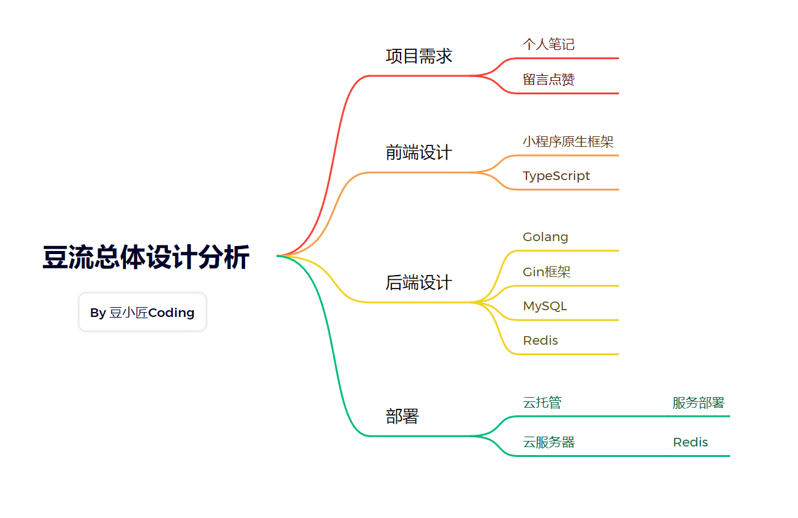

# 1. 豆流
> 一款个人笔记+分享留言小程序。
> 
> 一份Golang学习实战的资料。
> 
> 一个Gin框架项目搭建的脚手架。
> 
> 点个star，不迷路~

1. 后端源码地址：https://github.com/anjude/backend-beanflow
2. 小程序源码地址：https://github.com/anjude/miniprogram-beanflow

# 2. 快速开始

> 1. 安装golang 1.18+版本，配置好GOPATH
> 2. 本地安装mysql，创建数据库`bean_flow`，导入`docs/beanflow.sql`文件
> 3. 修改`config/config.dev.yaml`中的数据库配置
> 4. 运行`go mod tidy`，下载依赖
> 5. 运行`go run cmd/main.go`，访问`http://localhost/ping`，返回`pong`即为成功
> 6. 运行小程序，修改`miniprogram/config.js`中的`baseUrl`为`http://localhost:80`，即可访问

注：redis为可选，默认关闭，使用本地缓存，如需使用redis，修改`config/config.dev.yaml`中的`redis`配置即可
# 3. 业务功能
- [x] 用户登录
- [x] 笔记分享
- [x] 笔记留言
# 4. 框架能力
- [x] 配置文件读取
- [x] 日志链路追踪
- [x] 路由注册
- [x] 参数校验
- [x] 本地缓存
- [x] redis缓存
- [x] 代码检查
- [x] 代码部署
- [x] JWT鉴权
# 5. 交流学习
公众号内回复【**beanflow**】可获取项目设计文档，联系我+v可加入交流群，一起学习进步~

# 6. 版本和体验地址
仅为教学Demo，如失效请联系我参与体验版。

|  版本号   |     日期     |    说明     |
|:------:|:----------:|:---------:|
| v0.0.1 | 2023-12-02 | 第一版（新手友好） |
# 7. 鸣谢
[@poe：提供技术支持（AI大模型）](https://poe.com)

感谢以下开源项目，排名不分先后：
- Gin框架：https://github.com/gin-gonic/gin
- DDD模板：https://github.dev/takashabe/go-ddd-sample
- 代码目录结构参考：https://github.com/heynickc/awesome-ddd#go
- Go标准目录：https://github.com/golang-standards/project-layout/blob/master/README_zh.md

本项目仅做学习交流使用，如作它用所承受的法律责任一概与作者无关。